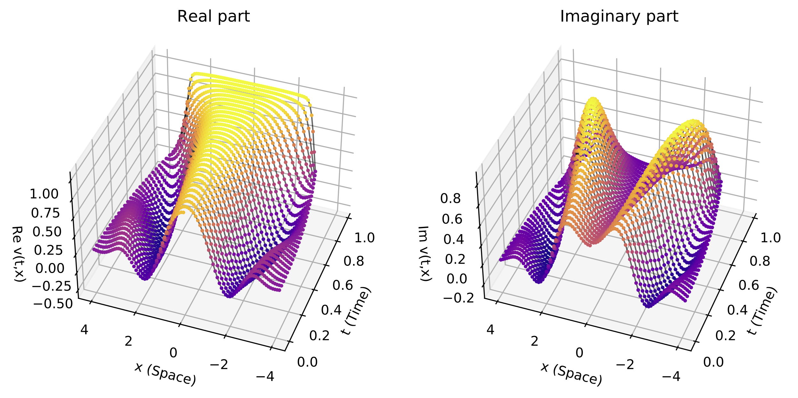

# BoundaryCrossingProbabilities.jl

This is a julia package for computing accurate approximations of the time-dependent boundary crossing probability for a general diffusion process. The implemented algorithm is based on a Brownian bridge corrected Markov chain algorithm proposed in: 

Liang, V. and Borovkov, K.: On Markov chain approximations for computing boundary crossing probabilities of diffusion processes. J. Appl. Probab. 60 1386–1415 (2023).

## Boundary crossing probabilities for diffusion processes with time-dependent boundaries

For $T>0,$ $x_0 \in \mathbb{R},$ let $X$ be a solution to the following stochastic differential equation:

$$ \begin{cases}
dX_t = \mu(t,X_t)dt +\sigma(t,X_t)dW_t, \quad t \in (0,T),\\ 
X_0 = x_0.
\end{cases}$$

where we assume $\mu$ and $\sigma$ satisfy the usual sufficient for the existence and uniqueness of a strong solution to the above SDE. 

For two continuous functions $g_-$ and $g_+,$ this package computes an approximation of the non-crossing probability

$$ 
	F(g_-,g_+) := \mathbf{P}(g_-(t) < X_t < g_+(t) , t\in [0,T]).
$$

More generally, the package can be used to compute Feynman-Kac type expressions of the form

$$ v(t,x) = \mathbf{E}[e^{-\int_t^TV(s,X_s)\,ds}\psi(X_T);g_{-}(s) < X_s < g_+(s), s \in [t,T] | X_t = x], $$

and

$$ u(t,x) = \frac{\partial}{\partial x}\mathbf{E}[e^{-\int_0^tV(s,X_s)\,ds} ; X_t \leq x, g_{-}(s) < X_s < g_+(s), s \in [0,t]|X_0 = x_0], $$

which are known to be probabilistic solutions to the Dirichlet problem for the following parabolic PDEs:

$$ Lv = 0, \quad v(t,g_{\pm}(t)) =0, \quad v(T,x)= \psi(x), $$

$$ L^*u = 0, \quad u(t,g_{\pm}(t)) =0, \quad u(0,x)= \delta_{x_0}(x), $$

where 

$$ L f(s,x) := \partial_sf(s,x) - V(s,x)f(s,x) + \mu(s,x) \partial_xf(s,x) + \frac{1}{2}\sigma^2(s,x) \partial_{xx}f(s,x).$$

## Code tutorial

To install and import the BoundaryCrossingProbabilities package, run the following in the Julia REPL

```
using Pkg
Pkg.add(url = "https://github.com/pika-pikachu/BoundaryCrossingProbabilities.jl")
using BoundaryCrossingProbabilities
```
### Example 1: Daniels boundary

In 1969, the statistician H. Daniels applied the method of images to obtain a closed-form expression for the boundary-crossing probability of the Brownian motion for a particular one-sided time-dependent boundary, now commonly known as the <i>Daniels boundary</i>,


$$ g(t) = \frac{1}{2} - t \log\left( \frac{1}{4}\left(1 + \sqrt{1 + 8e^{-1/t}}\right) \right),\quad t>0. $$

```
gU(t) = 1/2 - t * log(0.25 * (1 + sqrt(1 + 8*exp(-1/t))))
gL(t) = -3.75 # Assume -3.75 is sufficiently remote from initial position.
```

To set up the boundary crossing probability algorithm, we need to specify parameters of the diffusion process (initial position, drift, diffusion and potential), and the time interval. Let's take the Brownian motion example ($\mu \equiv 0,$ $\sigma \equiv 1$).

```
x0 = 0 # Initial condition
μ(t,x) = 0 # Drift coefficient
σ(t,x) = 1 # Diffusion coefficient
V(t,x) = 0  # Potential
T = 1.0 # Terminal Time
```

Next, we set up a Julia Type called MeshParams, which takes in all the diffusion process and Markov chain approximation parameters.

```
p = BoundaryCrossingProbabilities.MeshParams(
    x0, # x0 Initial condition
    T, # Terminal time	
    μ, # Drift coefficient
    σ, # Diffusion coefficient
    V, # Potential
    false, # no target set
    [1.2,3], # Target set X_T \in [a,b]
    "Brownian", #bridge correction,
    false, # one sided boundary
    25, # number of time steps 
    0, # δ, 1/2 + δ is the space step power before the final time
    1, # pn power of the space step at the final time
    2, # γ, constant space scaling
    "trapezoidal" # integration scheme
	);
```

Now we can run the algorithm with the following lines of code.

```
plotFlag = false
interpolationFlag = false
taboo_transition_density = BoundaryCrossingProbabilities.FKE(p, t -> gU(t), t -> gL(t), interpolationFlag, plotFlag);
boundary_crossing_probability = 1 - sum(taboo_transition_density) 
```
which returns
```
0.47977033599419694 - 0.0im
```

### Example 2: Complex potential

To set up the boundary crossing probability algorithm, we need to specify parameters of the diffusion process (initial position, drift, diffusion and potential), and the time interval. Let's take the Brownian motion example ($\mu \equiv 0,$ $\sigma \equiv 1$) with a complex potential term $V(t,x):= ix^2$.

```
x0 = 0 # Initial condition
μ(t,x) = 0 # Drift coefficient
σ(t,x) = 1 # Diffusion coefficient
V(t,x) = (1im)*x^2  # Potential
T = 1.0 # Terminal Time
```

Then we set up a Julia Type called MeshParams, which takes in all the diffusion process and Markov chain approximation parameters.

```
p = BoundaryCrossingProbabilities.MeshParams(
    x0, # x0 Initial condition
    T, # Terminal time	
    μ, # Drift coefficient
    σ, # Diffusion coefficient
    V, # Potential
    false, # no target set
    [1.2,3], # Target set X_T \in [a,b]
    "Brownian", #bridge correction,
    false, # one sided boundary
    25, # number of time steps 
    0, # δ, 1/2 + δ is the space step power before the final time
    1, # pn power of the space step at the final time
    2, # γ, constant space scaling
    "trapezoidal" # integration scheme
	);
```

Then we define the upper and lower boundaries.

```
gU(t) = 4 - t^2
gL(t) = -4 + t^2
```

Now we can obtain the solution to the problem. 

```
plotFlag = true
interpolationFlag = false

non_crossing_probability, v = BoundaryCrossingProbabilities.BKE(p, t -> gU(t), t -> gL(t), interpolationFlag, plotFlag);
#soltn_FKE, u = BoundaryCrossingProbabilities.FKE(p, t -> gU(t), t -> gL(t), interpolationFlag, plotFlag);
```



## Sensitivity of boundary crossing probabilities with respect to boundary perturbations

It was proved by Liang and Borovkov (2024) that the boundary non-crossing probability functional $F(g) := F(-\infty,g)$ is Gateaux differentiable and the derivative admits the following representation:

$$ \nabla_h F(g) := \lim_{\varepsilon \to 0}\frac{F(g+\varepsilon h) -F(g) }{\varepsilon} = -\int_0^T h(t)v'(t,g(t))f_{\tau}(t)dt,\quad h \in H, \quad g \in C^2.$$

The Markov chain approximation can be used to obtain approximations for $v'(t,g(t))$ and $f_{\tau}(t)$ for all $t \in [0,T].$
